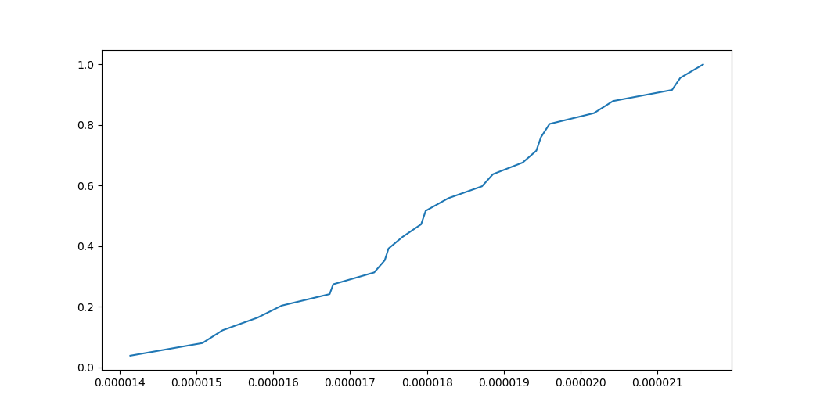
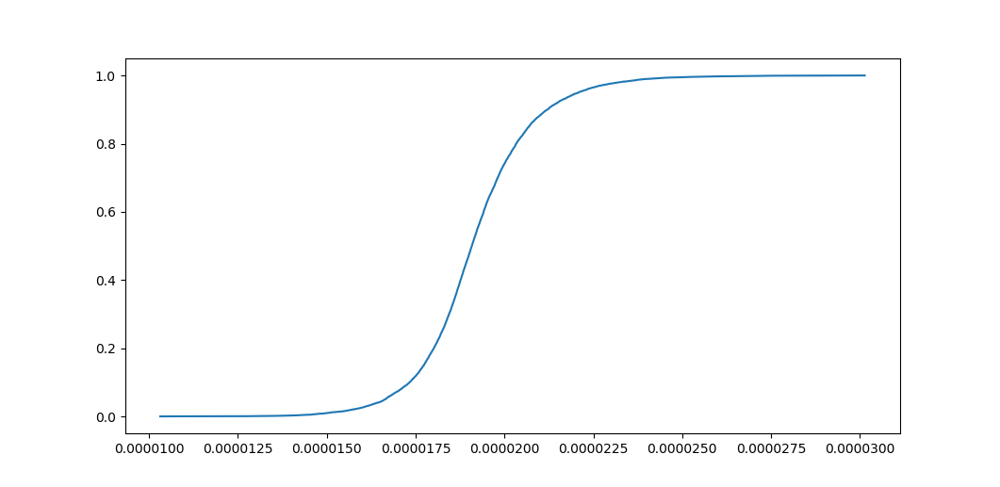

# Résultats des tâches fixés lors de notre dérnière réunion

On tiens à préciser que tous les tests (sauf mention contraire) ont été réalisé sur le jeu de donnée _IN11_10000.txt_
Correspandant à la fonction _CouplageOLT_

## Choix automatique des clusters

Le choix automatique des clusters se base sur la moyenne des différences entre la moyenne de X (plan d'éxpérience initial)
 et de K (clusters en prenant en considération les poids), à noter que cette erreur n'est calculé 
 que sur les cordonnées d'entrès (et non pas sur la valeur de sortie) ce choix est du au fait que
baser le calcul sur la valeur de sortie obligera l'utilisateur à founir (et donc éxécuter des éxpériences) nbExpOptimales! fois 
ce qui peut vite devenir problèmatique si le nombre d'éxpérience optimal est de 25 par exemple.
 
à titre de comparaison voici la moyenne d'erreur pour un `nbExp = 25` : 7.27768095662e-13

nous obtenons donc : 

    nbExp(Mor, 1e-12) = 8
    nbExp(Mor, 1e-13) > 50

## CDF (fonction de répartition ) dans le cas discret (MOR)

    CDF(0) = 0.0
    
    CDF(1.7984e-05) = 0.5165
    CDF(1.7313e-05) = 0.3129
    CDF(1.75e-05) = 0.3918
    
    CDF(500) = 1.0

La courbe ressemble à : 

## CDF (fonction de répartition ) dans le cas continu (Active Learning) (ordre 2)

    CDF(0) = 0.0
    
    CDF(1.7984e-05) = 0.1954
    CDF(1.7313e-05) = 0.0984
    CDF(1.75e-05) = 0.1184
    
    CDF(500) = 1.0

La courbe ressemble à : 

## K-Means par rapport à la variance

En modifiant l'algorithme k_means afin qu'il essaye d'optimiser la variance on obitnet (sur 25 itérations):

Erreur[var(k_means)] = 0.63659328033
Erreur[var(k_means non modifié)] = 0.636523373246

à priorie pas vraiment de différences

## ToDo

* AJouter interface MatLab (pas prioritaire)
* ~~Choisir automatiquement nombre de clusters~~
* ~~Ajouter CDF~~
* Ajouter la PDF
* Cf bootstraping
* Regressiin linéaire inverse

* ~~cdf continu~~
* recalculer poids dans mor_rapproché
* boucler k_means (erreur sur moyenne)
* plusieurs monte-carlo avec nbExps (model order reduction)
* ~~k_means with variance~~
* ~~tracer cdf~~
* tracer pdf

l'ecart type sur la moyenne de 100 ou 1000 tirages
superposer fcts de répartition

rapport += algos
rapport += 

envoyer plan rapport

présenter institut pascal (labo)
présenter contexte
ajouter diagrammes parler des frequences de réunion
ajouter bibliographie
implémentation des différentes taches

mise en forme des résultats physiques
parler de l'aspect théorique
partie résultats numériques
ajouter perspective

chercher une méthode pour illustrer clustering en dimension 10 (ou 4) [theta phi thetae E]

3 4 5 parties

